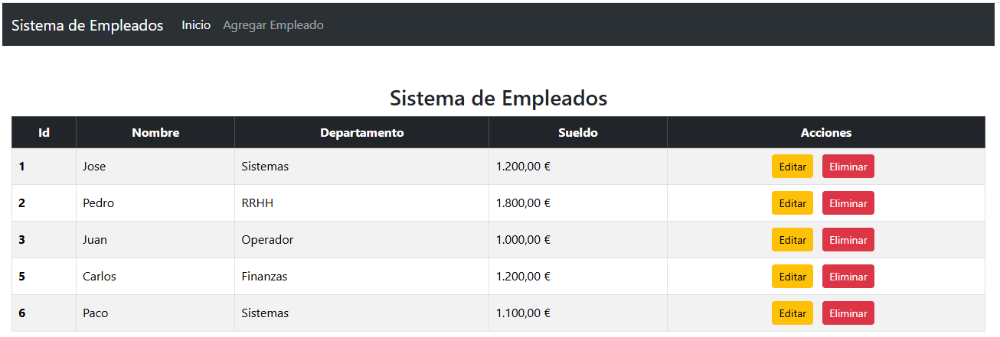
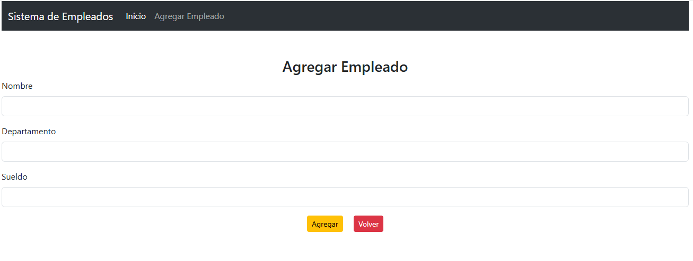
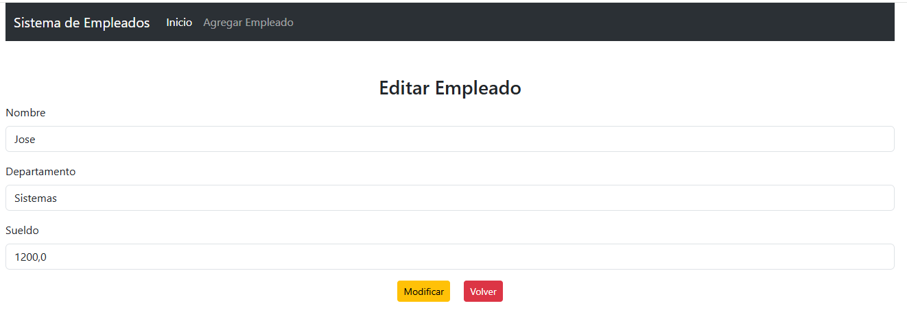

# 📋 Sistema de Gestión de Empleados

Este es un proyecto web desarrollado con **Java Spring Boot**, **JSP** y **MySQL**, que permite gestionar empleados de forma sencilla. El sistema incluye operaciones CRUD (Crear, Leer, Actualizar, Eliminar), conectando el backend con una base de datos relacional.

---

## 🖼️ Vista Previa

### 🔍 Lista de empleados


### ➕ Formulario de agregar


### ✏️ Formulario de edición


---

## 🛠️ Tecnologías utilizadas

- Java 21
- Spring Boot
- Spring MVC
- Spring Data JPA
- JSP y JSTL
- Bootstrap 5
- MySQL
- Maven

---

## ⚙️ Funcionalidades

- 🔍 **Listar empleados** con tabla visual e intuitiva.
- ➕ **Agregar nuevo empleado** (nombre, departamento y sueldo).
- ✏️ **Editar empleados existentes** con formulario precargado.
- 🗑️ **Eliminar empleados** de forma rápida.
- ✅ Validación y persistencia con JPA.
- 💅 Estilizado con Bootstrap para una interfaz moderna.

---

## 🚀 Cómo ejecutar el proyecto

1. Clona el repositorio:

```bash
git clone https://github.com/tu-usuario/sistema-empleados.git
cd sistema-empleados

---
### 📌 Autor
Desarrollado por Jose Luis Rodríguez
Contacto: josepayoyo2003@gmail.com
